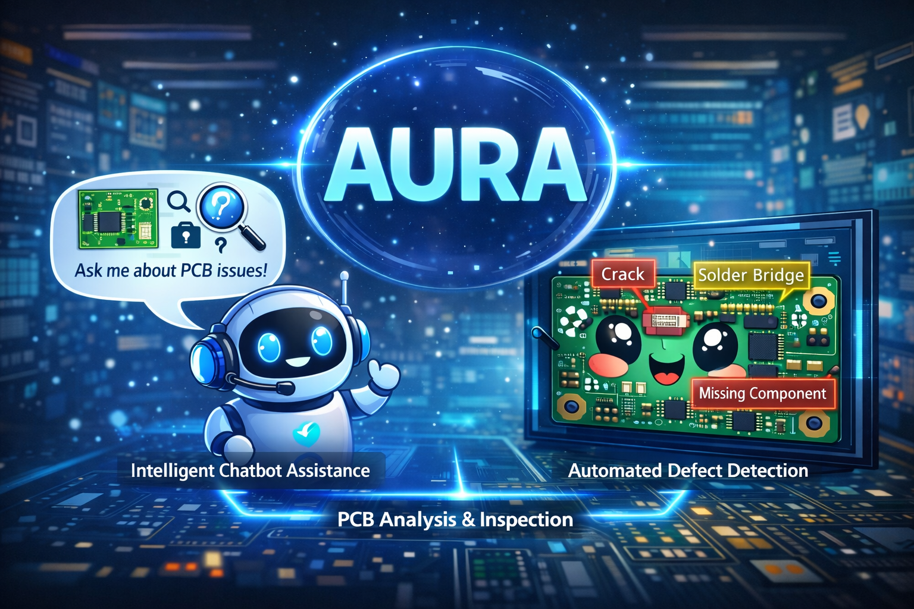

# AURA — Augmented Understanding for Reliable Anomaly-detection

<p align="center">
  
</p>

**AURA** is a GPU-accelerated, manual-agnostic tool for automated visual inspection of PCB assemblies. It combines multimodal Retrieval-Augmented Generation (RAG), vision-language models, and instance segmentation to detect, classify, and explain manufacturing defects with explicit references to industry standards.

AURA ships with a **pre-processed copy of the IPC-A-610F** standard — all vector indices and extracted figures are included, so users can test the tool immediately without any API key or manual processing. Additionally, AURA can ingest **any** PCB/electronics reference manual in PDF format.

---

## Table of Contents

1. [Features](#features)
2. [Architecture](#architecture)
3. [Prerequisites](#prerequisites)
4. [Quick Start — Docker (Recommended)](#quick-start--docker-recommended)
5. [Manual Installation (Without Docker)](#manual-installation-without-docker)
6. [Setting Up Ollama Models](#setting-up-ollama-models)
7. [Configuring the OpenAI API Key](#configuring-the-openai-api-key)
8. [Using the Application](#using-the-application)
9. [Loading the IPC-A-610F Manual](#loading-the-ipc-a-610f-manual)
10. [Uploading a Custom Manual](#uploading-a-custom-manual)
11. [Modes of Operation](#modes-of-operation)
12. [Project Structure](#project-structure)
13. [Troubleshooting](#troubleshooting)

---

## Features

| Capability | Description |
|---|---|
| **Multimodal RAG Retrieval** | Retrieves the most relevant reference figures from the loaded manual using a Qdrant vector store with OpenAI embeddings. |
| **Defect Analysis Agent** | Analyses PCB images for defects using either OpenAI GPT-5.2 or a local Ollama vision model (e.g. Qwen3-VL). |
| **Segmentation Agent** | Runs ByteDance Sa2VA-4B on the GPU to produce pixel-level defect segmentation masks. |
| **Explanation Agent** | Generates a detailed, standard-referenced explanation of the defect with severity classification. |
| **Manual Chatbot** | RAG-powered chatbot that answers questions about the loaded manual using a local Ollama LLM and FAISS text retrieval. |
| **Manual-Agnostic** | Upload any PCB/electronics standard in PDF form; the system parses it, extracts figures, and builds vector indices automatically. |
| **PDF Validation** | Uploaded PDFs are validated for domain relevance (PCB/electronics keywords) before processing. |

---

## Architecture

```
┌───────────────────────────────────────────────────────────────┐
│                     Streamlit UI (app.py)                     │
│  ┌──────────────────────┐   ┌──────────────────────────────┐  │
│     🔬 Image Analysis           💬 Manual Chatbot            │
│  │                      │   │                              │  │
│  │  1. Retrieval Agent  │   │  FAISS vector store          │  │
│  │  2. Defect Analysis  │   │  + Ollama local LLM          │  │
│  │  3. Segmentation     │   │  + PyMuPDF text extraction   │  │
│  │  4. Explanation      │   │                              │  │
│  └──────────┬───────────┘   └──────────────┬───────────────┘  │
│             │                              │                  │
│  ┌──────────▼──────────────────────────────▼───────────────┐  │
│  │                   manual_manager.py                     │  │
│  │  PDF parsing · image extraction · Qdrant + FAISS build  │  │
│  └─────────────────────────────────────────────────────────┘  │
└───────────────────────────────────────────────────────────────┘
                     │                    │
                     ▼                    ▼
                ┌─────────┐          ┌─────────┐
                │ Ollama  │          │  OpenAI │
                │ (local) │          │  API    │
                └─────────┘          └─────────┘
```

---

## Prerequisites

### Hardware

- **NVIDIA GPU** with at least **8 GB VRAM** (required for Sa2VA-4B segmentation).
- **NVIDIA driver** version **>= 535** installed on the host.
- At least **16 GB RAM** recommended.

### Software

| Requirement | Version | Notes |
|---|---|---|
| **Docker** | >= 24.0 | [Install Docker](https://docs.docker.com/get-docker/) |
| **Docker Compose** | >= 2.20 | Included with Docker Desktop |
| **NVIDIA Container Toolkit** | latest | Required for GPU passthrough into containers |

#### Installing the NVIDIA Container Toolkit

The NVIDIA Container Toolkit allows Docker containers to access the host GPU. Follow the official installation guide for your OS:

**Linux (Ubuntu/Debian):**

```bash
# Add the NVIDIA Container Toolkit repository
curl -fsSL https://nvidia.github.io/libnvidia-container/gpgkey \
  | sudo gpg --dearmor -o /usr/share/keyrings/nvidia-container-toolkit-keyring.gpg

curl -s -L https://nvidia.github.io/libnvidia-container/stable/deb/nvidia-container-toolkit.list \
  | sed 's#deb https://#deb [signed-by=/usr/share/keyrings/nvidia-container-toolkit-keyring.gpg] https://#g' \
  | sudo tee /etc/apt/sources.list.d/nvidia-container-toolkit.list

sudo apt-get update
sudo apt-get install -y nvidia-container-toolkit

# Configure Docker to use the NVIDIA runtime
sudo nvidia-ctk runtime configure --runtime=docker
sudo systemctl restart docker
```

**Windows (Docker Desktop):**

1. Install [Docker Desktop](https://www.docker.com/products/docker-desktop/) >= 4.27.
2. Ensure **WSL 2** backend is enabled (Settings → General → "Use the WSL 2 based engine").
3. GPU passthrough is supported natively on Docker Desktop for Windows with WSL 2 — no extra toolkit installation is needed, but your NVIDIA GPU driver must be >= 535.

**Verify GPU access:**

```bash
docker run --rm --gpus all nvidia/cuda:12.4.1-runtime-ubuntu22.04 nvidia-smi
```

You should see your GPU listed. If this fails, the NVIDIA Container Toolkit is not set up correctly.

---

## Quick Start — Docker (Recommended)

### 1. Clone or download this repository

```bash
git clone <repository-url> AURA
cd AURA
```

Or extract the provided archive:

```bash
unzip AURA.zip
cd AURA
```

### 2. Create the `.env` file

```bash
cp .env.template .env
```

Edit `.env`:

```dotenv
OPENAI_API_KEY=sk-your-actual-key-here
OLLAMA_HOST=http://ollama:11434
```

> **Important — when is the OpenAI API key needed?**
>
> | Scenario | API key required? |
> |---|---|
> | Testing with the **pre-built IPC-A-610F** manual + **Ollama models** | **No** |
> | Using the **GPT-5.2 (OpenAI)** model for Image Analysis | **Yes** |
> | **Uploading a new PDF** manual (embedding requires OpenAI) | **Yes** |
>
> If you only want to test AURA with the included IPC-A-610F data and Ollama models, you can leave `OPENAI_API_KEY` empty and skip this step entirely.

### 3. Build and start the containers

```bash
docker compose up --build -d
```

This will:
- Pull the `ollama/ollama` image and start the Ollama server with GPU access.
- Build the AURA image (CUDA 12.4 + Python + all dependencies) — **this may take 10–15 minutes the first time**.
- Start the Streamlit UI on port **8501**.

### 4. Pull an Ollama model

After the containers are running, pull at least one vision model for the Image Analysis mode and one text model for the Chatbot:

```bash
# Vision model for Image Analysis (Defect Analysis Agent)
docker exec -it aura-ollama ollama pull qwen3-vl:latest

# Text model for Chatbot (any Ollama model works)
docker exec -it aura-ollama ollama pull qwen3:8b
```

> **Tip:** The `qwen3-vl:latest` model is approximately **5 GB**. The pull may take several minutes depending on your internet speed. You can check progress with `docker logs -f aura-ollama`.

### 5. Open the application

Open your browser and navigate to:

```
http://localhost:8501
```

You should see the AURA interface with a sidebar for manual upload and mode selection.

### 6. Start using AURA

The **IPC-A-610F manual is pre-loaded** — it will appear automatically in the manual selection dropdown in the sidebar. No upload or processing is required. Select it and start analysing images or chatting with the manual immediately.

To upload a different manual, see [Uploading a Custom Manual](#uploading-a-custom-manual).

### 7. Stop the application

```bash
docker compose down
```

To also remove the persisted volumes (Ollama models + processed manuals):

```bash
docker compose down -v
```

---

## Manual Installation (Without Docker)

If you prefer to run AURA directly on your host machine (e.g. for development or if Docker is not available):

### 1. Prerequisites

- **Python 3.10 or 3.11** (3.12+ may have compatibility issues with some dependencies).
- **NVIDIA GPU** with CUDA 12.x drivers installed.
- **Ollama** installed locally — see [ollama.com](https://ollama.com/) for installation instructions.

### 2. Create a virtual environment

```bash
cd AURA
python -m venv .venv

# Linux / macOS
source .venv/bin/activate

# Windows
.venv\Scripts\activate
```

### 3. Install dependencies

```bash
pip install --upgrade pip
pip install -r requirements.txt
```

> **Note on PyTorch:** The `requirements.txt` installs `torch` from PyPI. If you need a specific CUDA version, install PyTorch manually first:
> ```bash
> pip install torch --index-url https://download.pytorch.org/whl/cu124
> ```

### 4. Configure environment variables

```bash
cp .env.template .env
```

Edit `.env`:

```dotenv
OPENAI_API_KEY=sk-your-actual-key-here
# When running locally, Ollama defaults to localhost:
OLLAMA_HOST=http://localhost:11434
```

### 5. Start Ollama and pull models

```bash
# Start Ollama (if not already running as a service)
ollama serve

# In a separate terminal, pull models:
ollama pull qwen3-vl:latest    # for Image Analysis
ollama pull qwen3:8b           # for Chatbot
```

### 6. Run the application

```bash
streamlit run app.py
```

Open `http://localhost:8501` in your browser.

---

## Setting Up Ollama Models

AURA uses [Ollama](https://ollama.com/) to run local LLMs. Two types of models are needed:

### Vision Model (for Image Analysis — Defect Analysis Agent)

The Defect Analysis Agent requires a **vision-language model** that can process images. The default is `qwen3-vl`:

```bash
ollama pull qwen3-vl:latest
```

This model will appear as **"Qwen3-VL (Ollama)"** in the sidebar model dropdown.

### Text Model (for Manual Chatbot)

The Chatbot uses a text-only Ollama model. Pull any model you prefer:

```bash
# Recommended options (pick one):
ollama pull qwen3:8b
ollama pull llama3.1:8b
ollama pull mistral:7b
```

The chatbot will auto-detect all installed Ollama models and let you select one from a dropdown in the sidebar.

### Verifying installed models

```bash
ollama list
```

This should show all pulled models with their sizes.

---

## Configuring the OpenAI API Key

The OpenAI API key is **optional for testing with the pre-built IPC-A-610F manual**. It is only required in two scenarios:

1. **Using GPT-5.2 (OpenAI) as the analysis model** — If you select "GPT-5.2 (OpenAI)" in the Image Analysis model dropdown.
2. **Uploading a new PDF manual** — The manual ingestion pipeline uses OpenAI embeddings to build the Qdrant multimodal vector index.

If you want to test AURA using **only open-source models** (Qwen3-VL for image analysis, any Ollama model for chatbot) with the **pre-built IPC-A-610F** data, no API key is needed at all.

To set the key:

1. Get an API key from [platform.openai.com](https://platform.openai.com/).
2. Add it to your `.env` file:
   ```dotenv
   OPENAI_API_KEY=sk-proj-your-key-here
   ```

---

## Using the Application

### Using the Pre-Built IPC-A-610F Manual

The repository includes a **fully pre-processed** copy of the IPC-A-610F standard. All vector indices (Qdrant multimodal + FAISS text) and extracted reference figures are already built and included in the `manuals/IPC-A-610F/` directory.

**No upload, no processing, and no OpenAI API key is needed to use it.**

1. Open the application at `http://localhost:8501`.
2. In the **left sidebar**, the **"📖 Reference Manual"** section will show **"IPC-A-610F"** already selected in the dropdown.
3. You are ready to use both modes immediately:
   - **🔬 Image Analysis** — Upload a PCB image and select **Qwen3-VL (Ollama)** as the model.
   - **💬 Manual Chatbot** — Ask questions about the IPC-A-610F standard.

> **No API costs are incurred** when using the pre-built manual with Ollama models. Everything runs locally.

### Uploading a Custom Manual

> **Requires an OpenAI API key.** The manual ingestion pipeline uses OpenAI embeddings to build the Qdrant multimodal vector index. Set `OPENAI_API_KEY` in your `.env` file before uploading a new manual.

You can upload any PDF manual related to PCB/electronics manufacturing:

1. Click **"Browse files"** in the sidebar.
2. Select your PDF file (max 200 MB).
3. The system validates the PDF for domain relevance. If the PDF does not contain enough PCB/electronics-related terms, it will be **rejected** with a message explaining why.
4. If accepted, the system will:
   - **Extract** all figures from the PDF using PyMuPDF.
   - **Build** a Qdrant multimodal vector index (text + image embeddings via OpenAI).
   - **Build** a FAISS text index for the chatbot (local HuggingFace embeddings).
   - This process takes **2–5 minutes** depending on your hardware.
5. Once complete, the new manual will appear in the selection dropdown and can be used with any model (including Ollama).

---

## Modes of Operation

### 🔬 Image Analysis

This mode performs a full four-stage inspection pipeline:

1. **Retrieval Agent** — Uploads a PCB image and retrieves the most visually similar reference figures from the loaded manual via Qdrant multimodal search.
2. **Defect Analysis Agent** — Analyses the PCB image (along with retrieved references) using a vision-language model. Reports whether a defect is present and its severity.
3. **Segmentation Agent** — If a defect is detected, runs **Sa2VA-4B** to produce pixel-level segmentation masks highlighting defect regions. The result is an overlay image with coloured masks.
4. **Explanation Agent** — Generates a detailed textual explanation of the defect, explicitly citing figures from the reference manual and providing a severity classification.

**How to use:**

1. Select **"🔬 Image Analysis"** in the sidebar.
2. Choose a model from the **"Analysis Model"** dropdown:
   - **GPT-5.2 (OpenAI)** — Requires an OpenAI API key.
   - **Qwen3-VL (Ollama)** — Runs locally, requires the model to be pulled.
3. Upload a PCB image (JPG, PNG, JPEG, or WEBP).
4. Click **"Analyze"** and wait for the pipeline to complete.

### 💬 Manual Chatbot

This mode provides a conversational interface for asking questions about the loaded manual:

1. Select **"💬 Manual Chatbot"** in the sidebar.
2. Choose an Ollama model from the dropdown.
3. Type your question in the chat input (e.g., *"What are the acceptability criteria for solder joints on BGA components?"*).
4. The system retrieves relevant passages from the manual via FAISS and generates an answer with page references.

---

## Project Structure

```
AURA/
├── app.py                      # Streamlit UI — main entry point
├── image_analysis_module.py    # Image Analysis pipeline (4 agents)
├── chatbot_module.py           # RAG chatbot module
├── manual_manager.py           # PDF ingestion, validation, index building
├── requirements.txt            # Python dependencies
├── Dockerfile                  # NVIDIA CUDA container definition
├── docker-compose.yml          # Multi-service orchestration (app + Ollama)
├── .env.template               # Environment variable template
├── .streamlit/
│   └── config.toml             # Streamlit server & theme configuration
├── sample_manuals/
│   └── IPC-A-610F.pdf          # Original PDF (for reference / re-upload)
└── manuals/
    └── IPC-A-610F/             # ★ Pre-built — ready to use out of the box
        ├── content/            # PDF + 400+ extracted reference figures
        ├── qdrant_data/        # Qdrant multimodal vector index (pre-built)
        ├── storage_dir/        # LlamaIndex persisted storage (pre-built)
        ├── vector_db/          # FAISS text index (pre-built)
        ├── cache/              # Page image cache
        └── manifest.json       # Processing completion marker
```

When a new manual is uploaded at runtime, a new subdirectory is created under `manuals/` with the same structure.

---

## Troubleshooting

### "No module named 'torch'" or CUDA not available

Ensure you installed PyTorch with CUDA support:

```bash
pip install torch --index-url https://download.pytorch.org/whl/cu124
```

Verify inside Python:

```python
import torch
print(torch.cuda.is_available())  # Should print True
print(torch.cuda.get_device_name(0))
```

### Ollama connection refused

- **Docker:** Ensure the Ollama container is running: `docker compose ps`. The `OLLAMA_HOST` in `.env` must be `http://ollama:11434` (not `localhost`).
- **Local:** Ensure Ollama is running: `ollama serve`. The `OLLAMA_HOST` should be `http://localhost:11434`.

### "No models available" in the Chatbot dropdown

You need to pull at least one Ollama model:

```bash
# Docker:
docker exec -it aura-ollama ollama pull qwen3:8b

# Local:
ollama pull qwen3:8b
```

### PDF rejected as "not PCB/electronics related"

The validation checks for domain-specific keywords (e.g., "solder", "PCB", "defect", "assembly"). If your manual uses very different terminology, you can adjust the thresholds in `manual_manager.py` by modifying `_MIN_KEYWORD_HITS` and `_MIN_CATEGORIES`.

### Segmentation Agent fails or is very slow

- The Sa2VA-4B model is **downloaded automatically** from HuggingFace on first use (~8 GB). Ensure you have internet access and sufficient disk space.
- It requires a GPU with at least **8 GB VRAM**. If running out of memory, the model will fall back to CPU (very slow).
- First inference is slower due to model loading; subsequent calls reuse the cached model.

### Docker build fails on `pip install`

- Ensure your Docker daemon has internet access.
- If behind a proxy, configure Docker proxy settings.
- The build may take 10–15 minutes due to PyTorch and transformer model dependencies.

### "OPENAI_API_KEY not set" error

This only affects the GPT-5.2 model option. If you want to use only Ollama models, select **"Qwen3-VL (Ollama)"** in the model dropdown instead.

---

## License

This tool is provided as a companion artifact for the demo paper. Please refer to the paper for citation and usage terms.
